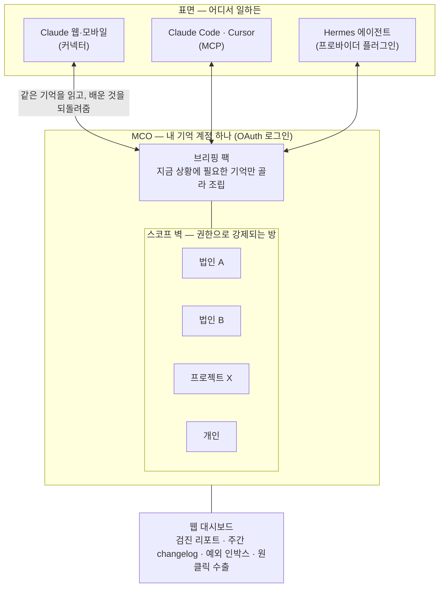
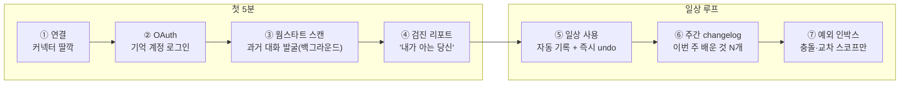

# MCO 시스템 개요 v0.1 (2026-07-12)

> **무엇을 읽는 문서인가.** MCO가 무엇이고, 누구의 어떤 문제를 어떤 경험으로 푸는지 정리한 개요다 — 기술 배경 없이 읽히는 것을 목표로 한다. 시스템의 내부 구조는 [아키텍처 설명](../Product/MCO_아키텍처설명_v0_1.md), 무엇 위에 올리는지는 [인프라 구축](../Product/MCO_인프라구축_v0_1.md) 참조. 이 문서는 2026-07-11까지 정렬된 합의의 문서화이며(새 설계 없음), 결정의 근거·출처는 §8의 정본 문서들에 있다.

---

## 1. 한 줄 정의

**MCO(Memory Context Orchestrator)는 사용자의 기억을 사용자 계정에 묶어 관리하고, 어떤 AI를 쓰든 지금 상황에 필요한 기억만 골라 공급하는 메모리 오케스트레이션 레이어다.** GPT·Claude 같은 LLM을 대체하지 않는다 — 그 앞단에서 개인의 기억을 다뤄주는 계층("메모리 OS")이다.

가장 빠른 이해는 대비 한 문장이다:

> **Hermes = 기억을 가진 에이전트 하나. MCO = 당신의 모든 에이전트가 공유하는 기억 하나.**

겉으로 보이는 약속("나를 기억하는 AI")은 비슷하지만 구조가 반대다. 기억이 특정 에이전트 안에 사는 것이 아니라 **사용자 계정에 살고**, 모든 에이전트·모델·앱이 그 하나의 기억을 공유한다. 그래서 모델이나 도구를 바꿔도 같은 진실이 같은 형태로 조립되어 들어간다 — **"원 브레인, 멀티 서피스."**

그리고 코어 가치는 저장이 아니라 **선택**이다. 많이 기억하는 시스템이 아니라, 지금 대화에 필요한 기억만 꺼내고 무관한 기억을 걸러내는 **노이즈 필터**. 실패 기준까지 정의되어 있다: 애플워치 이야기를 하는데 무관한 다른 프로젝트 기억이 끼어들면 그 시스템은 실패다.

## 2. 개념도

읽는 법: 위쪽의 표면(Claude 웹, 코딩 에이전트, Hermes 등)이 어떤 조합이든, 가운데의 기억 계정은 하나다. 기억은 법인·프로젝트·개인 같은 **스코프 벽** 안에 나뉘어 살고, 이 벽은 라벨이 아니라 권한으로 강제된다. 각 표면에는 그 상황에 맞는 기억만 담은 **브리핑 팩**이 전달되고, 표면에서 새로 배운 것은 다시 기억으로 환류된다. 대시보드는 이 전체를 들여다보는 창이다.

## 3. 누구의 어떤 아픔인가

**타깃 페르소나 = 컨텍스트가 돈인 프로슈머.** 여러 법인·클라이언트·프로젝트를 병행하면서 AI를 채팅 하나가 아니라 여러 도구·에이전트로 굴리는 사람 — 빌러블 아워, 마감, 서류, 멀티 법인의 세계다. 디자인 센터는 **에이전트 함대를 지휘하는 사람**이고, 채팅만 쓰는 사용자는 '함대 크기 1'의 특수해로 자연스럽게 포함된다.

경계도 분명하다: 컨텍스트가 하나뿐인 사용자는 Hermes 같은 단일 에이전트 기억으로 충분하다 — 우리 고객이 아니다. 법인·클라이언트·표면·에이전트가 N개가 되는 순간, 에이전트 안에 갇힌 기억으로는 구조적으로 풀리지 않는다.

페인에는 실측으로 확인된 서열이 있다 (2026-07-11 검증 — 근거: [사업성 분석](../docs/리서치/MCO_사업성분석_v0_1.md) §4 · [검증 리포트](../docs/리서치/MCO_검증리포트_v0_1.md) §1):

| 서열 | 페인 | 증거 요지 |
|---|---|---|
| **1. 오염** | 다른 맥락의 기억이 끼어든다 | 벤더 기억이 보편화되자 파워유저들이 오히려 기능을 **끄기 시작** — 직장↔취미 오염, 에이전시의 클라이언트 간 오염, 판타지 채팅 속 이름이 역사 프로젝트에 주입된 실사고 |
| **2. 무영향** | 기억이 쌓여도 행동이 안 바뀐다 | "기억은 기록만 되고 반영이 안 돼 무용지물" — 공개 이슈 트래커의 반복 보고 |
| **3. 부재** | 도구를 옮기면 처음부터 재설명 | 세션당 재발견 10–15분, 재설정 ~20k 토큰, "AI 바꿀 때마다 나를 다시 소개해야" |

이 서열이 제품 서사를 결정한다: **"기억을 준다"가 아니라 "기억을 믿을 수 있게 한다."** 특히 오염(플랫폼의 참여 지표 인센티브와 충돌)과 감사·삭제 보증(광고 인센티브와 충돌)은 플랫폼이 스스로 풀 이유가 없는 페인이라, 서사를 이 두 곳에 집중한다.

## 4. UX 원칙 4개

**① 딸깍 연결.** OAuth 로그인 한 번으로 모든 표면에서 같은 기억이 열린다. 터미널 명령·인프라 설정 없음 — "터미널이 필요하면 우리 엄마는 절대 못 쓴다"는 실측 교훈이 기준선이다.

**② 첫 5분.** 연결하자마자 보여준다. 백그라운드로 기존 대화·기억을 발굴(웜스타트 스캔)하고 첫 검진 리포트를 내민다. 서드파티 기억은 모델이 도구를 불러야 작동하므로 '저절로 아는' 첫 경험은 약속할 수 없다 — 대신 '연결하자마자 보여주는' 첫 경험은 우리가 제어하는 호출로 100% 재현된다.

**③ 작동은 투명, 신뢰는 가시.** 기록은 자동·백그라운드로 조용히 되지만, 무엇이 기록됐는지는 항상 보이고(주간 changelog·감사 로그·줄마다 출처) 즉시 되돌릴 수 있다(undo). 같은 사용자층이 '몰래 기억'과 '승인 질문 폭탄' 둘 다를 벌한다는 것이 실측 결론 — 검증된 해법은 자동 기본 + 가시 로그 + 되돌리기다.

**④ 권한은 교차 스코프만 묻는다.** 법인·프로젝트·에이전트 벽은 기본 분리로 자동 배정된다. 사람에게 묻는 순간은 단 둘 — 벽을 넘는 접근, 그리고 기억끼리의 충돌(사람만 판정할 수 있는 것)뿐이다.

## 5. 사용자 여정 — 첫 5분과 그 후

**① 연결.** Claude 웹(또는 데스크톱·모바일)에서 MCO 커넥터를 추가한다. 설치할 것도, 설정 파일도 없다.

**② OAuth.** 브라우저에서 기억 계정에 로그인한다. 이 리다이렉트 화면이 곧 온보딩 화면이다 — 기억은 이 순간부터 플랫폼이 아니라 사용자 계정 소유가 된다.

**③ 웜스타트 스캔.** 연결 직후 백그라운드에서 기존 대화 이력·기억을 발굴해 초기 기억을 채운다. 빈 시스템에 처음부터 다시 가르치는 일이 없도록.

**④ 검진 리포트.** "내가 아는 당신"을 처음으로 보여준다 — 감사 보고서가 아니라 공유하고 싶어지는 재미(roast) 톤으로. 온보딩의 마지막 단계로 "작업 시작 전 memory_brief 호출" 지침 스니펫을 원클릭 설치하게 안내하고, 도구가 실제로 발화하는지 self-test까지 확인한다.

**⑤ 일상.** 이후에는 그냥 쓴다. 대화·에이전트 런에서 배울 가치가 있는 것은 자동으로 기록되고, 항목마다 즉시 undo가 붙는다. 작업 중에 "이거 기억할까요?" 하고 끼어드는 일은 없다.

**⑥ 주간 changelog.** 일주일에 한 번 "이번 주 배운 것 N개"가 온다. 항목별로 원클릭 제외·수정·출처 확인이 가능하다 — 신뢰를 만드는 가시성의 리듬.

**⑦ 예외 인박스.** 결정 인박스는 모든 기록의 관문이 아니라 **예외 처리함**이다. 기억끼리의 충돌, 벽을 넘는 접근 요청, 만기 임박 같은 사람의 판정이 필요한 것만 올라오고, 방치해도 시스템은 기본값으로 굴러간다.

## 6. 안에서 일하는 스몰 모델 5역할

MCO 안에는 대답을 만드는 큰 모델이 아니라, 기억을 다루는 판단만 하는 **작은 모델**이 있다. 개인 기록 보관소에 상주하는 사서를 떠올리면 된다:

| # | 역할 | 사서 은유 | 하는 일 |
|---|---|---|---|
| ① | 기억 가치 판단 | 접수 데스크 | 대화·에이전트 런의 부산물 중 보관할 가치가 있는 것만 접수한다 — 남길/버릴 이유를 명시하는 게이트 |
| ② | 저장 범위 결정 | 서가 배정 | 이 기억이 속한 방(계정·법인·프로젝트·에이전트)을 정한다 |
| ③ | 충돌 감지 | 모순 발견 | 기존 기억과 어긋나는 새 정보를 찾아 표시한다 → 판정은 사람의 예외 인박스로 |
| ④ | 갱신 | 개정 관리 | 낡은 기억을 지우지 않고 '더 이상 유효하지 않음'으로 무효화하고, 자주 쓰는 기억은 승격·안 쓰는 기억은 강등한다 |
| ⑤ | **기억 선택** ★ | 사서의 추천 | 질문·작업에 지금 딱 필요한 기억만 골라 브리핑 팩으로 조립한다 — 코어 중의 코어 |

단순한 저장·검색(메모리 RAG)이 아니라 다섯 단계 모두에 판단이 들어간다는 것이 차별점이고, 그 판단력이 승부처다. 정직하게 표기하면: 이 게이트·선택의 **정밀도가 유일한 미검증 코어**이며, 구현 전 정밀도 실험(강한 베이스라인 +10점)이 관문으로 잡혀 있다 — 통과 전까지 이 판단력은 '잠정'이다.

## 7. 무엇이 아닌가 — 가드레일

**에이전트 오케스트레이션 프레임워크가 아니다.** 에이전트를 스케줄링·라우팅하지 않는다 — 그건 하네스의 몫이다. MCO가 오케스트레이션하는 것은 기억이다.

**관측(observability)·트레이싱 제품이 아니다.** 에이전트 런의 배기가스(로그·결과물)는 입력일 뿐, 제품은 기억이다.

**GB 저장 장사가 아니다.** 매출이 저장량에 비례하는 순간 축적을 최적화하게 되고, 그러면 노이즈가 쌓여 "무관한 기억을 걸러낸다"는 핵심 논거와 자충한다. 가치의 척도는 저장량이 아니라 선택의 정밀도다.

## 8. 더 읽을 문서

| 궁금한 것 | 문서 |
|---|---|
| 내부 구조 — 레이어·데이터 흐름·스키마·모델 선택 | [`Product/MCO_아키텍처설명_v0_1.md`](../Product/MCO_아키텍처설명_v0_1.md) |
| 무엇 위에 올리나 — 인프라 구성·원가·보안·리스크 | [`Product/MCO_인프라구축_v0_1.md`](../Product/MCO_인프라구축_v0_1.md) |
| 결정의 정본과 근거 | `Product/MCO_아키텍처_v0_1.md` · `docs/charter.md`(v0.2) · `docs/리서치/MCO_검증리포트_v0_1.md` · `docs/리서치/MCO_사업성분석_v0_1.md` · `docs/리서치/MCO_한국어검색스택_v0_1.md` |

---

*작성: 2026-07-12 문서화 세션. 소스 합의 기준일 2026-07-11(아키텍처 v0.1 P1~P8 반영본). 이 문서는 서사 담당 — 구조는 아키텍처설명, 구성은 인프라구축이 담당한다.*
