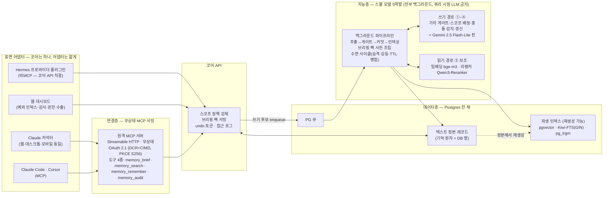
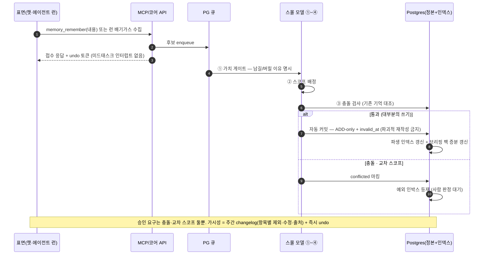
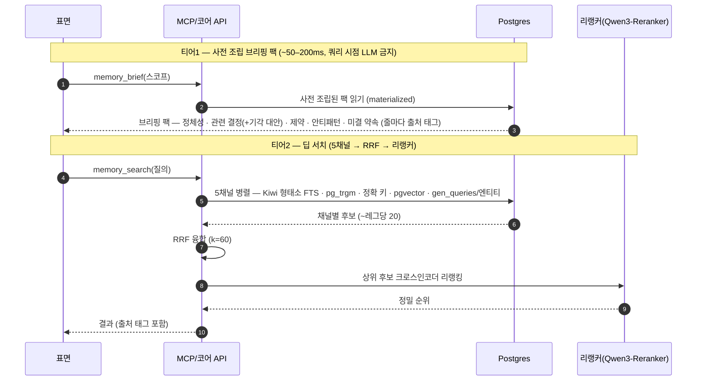

# MCO 아키텍처 설명 v0.1 (2026-07-12)

> **무엇을 읽는 문서인가.** 시스템 아키텍처의 구조 설명본이다 — 레이어 구성, 데이터 흐름 3개(쓰기·읽기·유지), 기억 원자 스키마, 모델 선택을 한눈에 들어오게 정리한다. 결정 정본과 근거·출처는 [`MCO_아키텍처_v0_1.md`](MCO_아키텍처_v0_1.md)(P1~P8 반영)에 있고, 이 문서는 그 구조를 설명한다. 서사·UX는 [시스템 개요](../Concept/MCO_시스템개요_v0_1.md), 인프라 구성은 [인프라 구축](MCO_인프라구축_v0_1.md) 참조.

---

## 1. 전체 아키텍처



| 레이어 | 역할 | 핵심 결정 |
|---|---|---|
| 표면 어댑터 | 획득·사용 접점. 웹(Claude 커넥터) = 일반용, 하네스(Claude Code·Cursor) = 자동 주입을 제어할 수 있는 심화 표면, Hermes 프로바이더 = 비MCP 얇은 어댑터, 웹 대시보드 = 예외 처리·감사 | 코어 서버는 하나, 표면별 어댑터만 얇게. Claude-first는 취향이 아니라 소거법(무료 플랜 커스텀 커넥터 1개 제한 = "그 한 슬롯을 이기는 게임") |
| 연결층 | 무상태 MCP 서빙 + OAuth 2.1(DCR+CIMD) | 2026-07-28 MCP 개정(세션 핸드셰이크 제거)에 무상태 설계로 대응. 도구는 적고·겹치지 않고·when-to-use 명시, 전 도구 `title`+`readOnlyHint`. 실험적 Tasks API 사용 금지 |
| 코어 API | 스코프 = 권한 강제(태그 필터 아님), undo, 감사 | 모든 표면이 같은 코어를 통과 → 입력 일관성의 물리적 기반 |
| 지능층 | 스몰 모델 5역할(판단만 담당) | LLM은 판단만, 기계적인 것은 비-LLM(중복=임베딩 유사도/LSH, 시간 질의=날짜 연산). 모델 선택은 §8 |
| 데이터층 | 텍스트 정본 + 파생 인덱스 + PG 큐 | Postgres 한 채(현업 수렴). 검색 5채널 전부 Postgres 안 — 상세는 §7과 [인프라 구축](MCO_인프라구축_v0_1.md) |
| 백그라운드 파이프라인 | 쓰기 처리·팩 사전 조립·수면 사이클 | 큐 = Postgres 자체(소규모 팀 인프라 최소화). 지연 초~수십 초 = 현업 정상 |

## 2. 설계 대원칙 — 텍스트 정본, 파생 인덱스

**정본 = 구조화 텍스트 레코드(DB 행). 벡터·FTS·그래프는 정본에서 언제든 재생성 가능한 파생 인덱스다.**

왜 이 규칙이 대원칙인가: 임베딩 모델 교체·업그레이드(자체 파인튜닝 포함) 시 전량 재인덱싱이 무손실 배치 작업이 된다 — 지능에 대한 투자를 보호하는 배치 규칙이다. 그리고 프론티어 모델에 최종 전달되는 것은 어차피 텍스트(MCP)다.

이를 3층으로 부르면: **저장 = 커모디티**(아무나 조립 가능한 바닥재), **지능 = 투자처**(게이트·선택의 판단력), **정본 규칙 = 보호 장치**(지능층을 갈아끼워도 자산이 남게 하는 규칙).

## 3. 기억 원자 스키마

기억 한 건 = DB 한 행:

```
id           : SHA-256 콘텐츠 주소 (멱등 재수집)
content      : 1~3문장 자연어 (모델 불가지론)
type         : 사실 | 선호 | 결정(+근거+기각된 대안) | 실패/안티패턴 | 약속 | 에피소드요약
scope        : 계정 / 법인 / 프로젝트 / 에이전트        ← 오염 페인의 벽. 태그가 아니라 권한 강제
provenance   : 출처 세션·날짜 + 단언 주체(유저 발화 vs 에이전트 추론)  ← "왜 알아?" 감사
trust_level  : 사람 단언 > 검증된 런 산출 > 비신뢰 콘텐츠 유래    ← 저신뢰는 고권한 문맥 자동 주입 금지(보안 통제 1)
ttl_class    : 불변 | 저부패(선호·스택) | 고부패(현재 상태) | 만기고정(계약·마감)
bi-temporal  : created_at / valid_at / invalid_at / expired_at   ← 삭제 대신 무효화
status       : active | deprecated | conflicted
relations    : supersedes / conflicts-with / derived-from        ← 모순 동시-인출 방지
confidence   : 게이트 판정 + 사용 피드백으로 갱신
gen_queries  : 쓰기 시점 생성 검색 쿼리 3~5개(별도 임베딩)      ← 회수율을 쓰기 시점에 구매
```

필드가 곧 제품 논리다: `scope`가 오염 페인의 해법(벽), `provenance`가 감사·신뢰의 해법("왜 이걸 알아?"에 항상 답할 수 있음), `trust_level`이 주입 오염 방어의 해법(비신뢰 유래 기억은 고권한 문맥에 오르지 못한다 — lethal trifecta 대응, 통제 6항 정본 `.claude/memory/mco-security-model.md`), `ttl_class`+bi-temporal이 신선도의 해법(파괴적 삭제 대신 무효화 마킹 — undo가 무비용인 이유), `gen_queries`가 회수율을 쓰기 시점에 미리 사두는 장치다.

## 4. 2계층 기억 — 설정성 vs 사건성

두 종류의 기억은 물리 법칙이 다르다:

| | 설정성 기억 | 사건성 기억 |
|---|---|---|
| 내용 | 정체성·톤·선호·스택·규칙·환경 = "에이전트 세팅" | 결정·약속·사건·실패·논의 이력 = 원장 |
| 필요 패턴 | 해당 스코프에서 **항상** — 놓치면 사고 | 가끔, 질문 따라 |
| 방식 | **검색하지 않는다. 상시 주입** — T0 코어(~500tok) + T1 스코프 세트(스코프당 상한 강제) | **하이브리드 검색** — T2 원장 + T3 에피소드 아카이브(재추출 광산) |

원칙: **확실히 필요한 건 주입, 아마 필요한 건 검색.** 상한 강제 큐레이션과 "꽉 차면 에러(침묵 삭제 금지)" 인터페이스는 Hermes에서 차용, 개선점은 전역→스코프 벽·동결 스냅샷→서버사이드 라이브 갱신. **승격/강등 순환**이 이 구조의 엔진이다: T2에서 반복 인출되는 기억은 T1로 승격, T1에서 안 쓰이는 기억은 T2로 강등 — 상한이 순환을 강제하고, 이것이 "기억이 발전한다"의 실제 메커니즘이다.

## 5. 데이터 흐름 ① 쓰기 — 자동 기록 + 즉시 undo



**기록-후-되돌리기 원칙**(검증 P2로 역전된 설계): 제안→승인이 아니라 자동 커밋+즉시 undo가 기본이다. 승인 피로("아침에 73건 = 반사적 승인")와 승인형 기능의 실제 제거 사례가 근거. ADD-only+invalid_at 스키마 덕에 undo는 무비용이고, 결정 인박스는 모든 쓰기의 관문이 아니라 **예외 처리함**이다 — 방치해도 시스템은 기본값으로 굴러간다. 교차 스코프 write 승인은 UX 규칙이자 보안 통제이기도 하다 — 런은 자기 스코프에만 write한다(write-back = 중대 행동: 오염 기억의 타 스코프 전파 봉쇄, 보안 통제 2).

## 6. 데이터 흐름 ② 읽기 — 2티어



티어1이 UX 약속("회상 무감각")의 담당이다: 브리핑 팩은 쓰기 시점에 백그라운드에서 미리 조립해 두고(증분 갱신 — cron 재빌드 아님), 도구 호출 시에는 DB 읽기만 한다. **같은 팩이 어떤 모델에든 들어간다 = 입력 일관성**(§9). 티어2는 원장 전체를 뒤지는 딥 서치로, 5채널의 역할 분담은 [인프라 구축](MCO_인프라구축_v0_1.md) §4와 한국어 검색 스택 정본 참조. 예외 하나: 실패/안티패턴 기억은 상시 주입하면 무시된다는 실측 교훈 때문에 **관련 행동 감지 시 적시 주입**한다.

## 7. 데이터 흐름 ③ 유지 — 수면 사이클

백그라운드 배치(할인 배치 API 활용)로 도는 유지 작업: 중복 병합(임베딩 유사도/LSH — LLM 아님) · 미사용 감쇠 · TTL 만기 강등 · 충돌 스윕 · 스키마 개선 시 T3 에피소드 아카이브 재추출. §4의 승격/강등 순환도 여기서 집행된다. 유지가 있어야 원장이 노이즈 무덤이 아니라 살아있는 기억이 된다.

## 8. 모델 선택표 — 확정 기본값 vs 벤치 게이트 대기

전 항목에 **2중 게이트**가 적용된 결과다: ⓐ 관리형 호환성(우리 관리형 프로바이더에 실존하는가) ⓑ 한국어 실측 근거(없으면 확정 금지, 자체 벤치 게이트 뒤로).

| 역할 | 확정 기본값 (근거) | 벤치 게이트 대기 / 잠정 |
|---|---|---|
| 추출 LLM (쓰기 ①~④) | **Gemini 2.5 Flash-Lite 핀** — $0.10/$0.40 per 1M, 구조화 출력 100% 유효 JSON, 유사 서비스가 파인튜닝해 프로덕션 운용하는 베이스. 3.1 Flash-Lite는 비용 2.5~3.75×라 핀 고정 | ⚠️ 핀 자체가 **한국어+코드스위칭 자체 벤치 게이트 조건부**(한국어 공개 벤치 부재). 증거 기반 스왑 후보 = GPT-5-mini(KMMLU 76.47 실측), 대안 GPT-5-nano |
| 임베딩 | **bge-m3** — 한국어 실증(Ko-MTEB IR 79.30, recall@10 0.792) + 관리형 실재(DeepInfra $0.01/1M·Workers AI $0.012/1M) = Gemini 대비 1/15 비용. MRL 1024 | Gemini embedding · voyage-4-lite(둘 다 한국어 공개 실측 0) · KURE-v1(+1.5 NDCG이나 관리형 호스트 없음) — **자체 한국어 벤치에서 이기면 승격** |
| 리랭커 | **Qwen3-Reranker-0.6B/4B** — 한국어 18,945쿼리 실측 1위(4B MRR@10 0.8324, 0.6B 0.8095), DeepInfra $0.01/1M, Apache-2.0. 폴백 = bge-reranker-v2-m3(0.8113, 한국어 실전 최다) | Voyage rerank-2.5-lite(한국어 공개 실측 0) — 자체 벤치 승격제. zerank-2 = 비상업 라이선스, 협의 항목(선택). LLM 리스트와이즈 리랭킹은 실시간 금지(1–3s+) |

참고: 위 기본값들의 승격/스왑 판정은 전부 **구현 전 API 수준의 한국어 부품 벤치 3건**(리랭커·임베딩·추출)에 걸려 있다 — 목록·하네스는 [인프라 구축](MCO_인프라구축_v0_1.md) §9. 라벨이 축적된 뒤의 자체 파인튜닝 경로도 인프라 문서 §7 참조.

## 9. 크로스 모델 일관성의 원리

"여러 모델을 오가도 일관된 추론"은 마법이 아니라 **입력 일관성**이다:

1. 정본이 텍스트다 — 기억은 특정 모델의 임베딩 공간이 아니라 자연어 레코드로 산다.
2. 같은 브리핑 팩이 나간다 — 어떤 표면·어떤 모델이 호출해도 같은 스코프에는 같은 팩(같은 텍스트)이 조립된다. 쿼리 시점 LLM이 없으므로 조립 결과가 모델에 따라 흔들리지 않는다.
3. MCP로 최종 전달되는 것은 어차피 텍스트다 — 프론티어 모델 입장에서 MCO는 '일관된 입력 공급자'다.

따름 정리: 모델 교체·병행이 자유롭다(락인 없음). 임베딩·검색 스택을 갈아끼워도 파생 인덱스만 재생성하면 된다(§2). 데모 목표도 이 원리의 시연이다 — 같은 질문을 Claude 웹·Claude Code·Hermes+MCO에서 던져 같은 브리핑·같은 결론을 얻는 것("원 브레인, 멀티 서피스").

## 10. 관련 문서

| 문서 | 담당 |
|---|---|
| [`Concept/MCO_시스템개요_v0_1.md`](../Concept/MCO_시스템개요_v0_1.md) | 서사 — 정의·페르소나·UX 원칙·사용자 여정 |
| [`Product/MCO_인프라구축_v0_1.md`](MCO_인프라구축_v0_1.md) | 구성 — 인프라 스택·원가·보안·이주 경로·미결 표 |
| [`Product/MCO_아키텍처_v0_1.md`](MCO_아키텍처_v0_1.md) | **결정 정본** — 모든 선택의 근거·출처 링크 |
| `docs/리서치/MCO_한국어검색스택_v0_1.md` · `MCO_검증리포트_v0_1.md` | 검색 5채널·모델 교정(P8)·패치(P1~P7)의 검증 근거 |

---

*작성: 2026-07-12 문서화 세션. 소스 합의 기준일 2026-07-11(P1~P8 반영). 이 문서는 구조 담당 — 수치·출처의 정본은 `MCO_아키텍처_v0_1.md`.*

*2026-07-12 개정: 보안 통제 반영 — §3 trust_level 필드, §5 write-back 스코프 고정(통제 2). 통제 6항 정본: `.claude/memory/mco-security-model.md`.*
