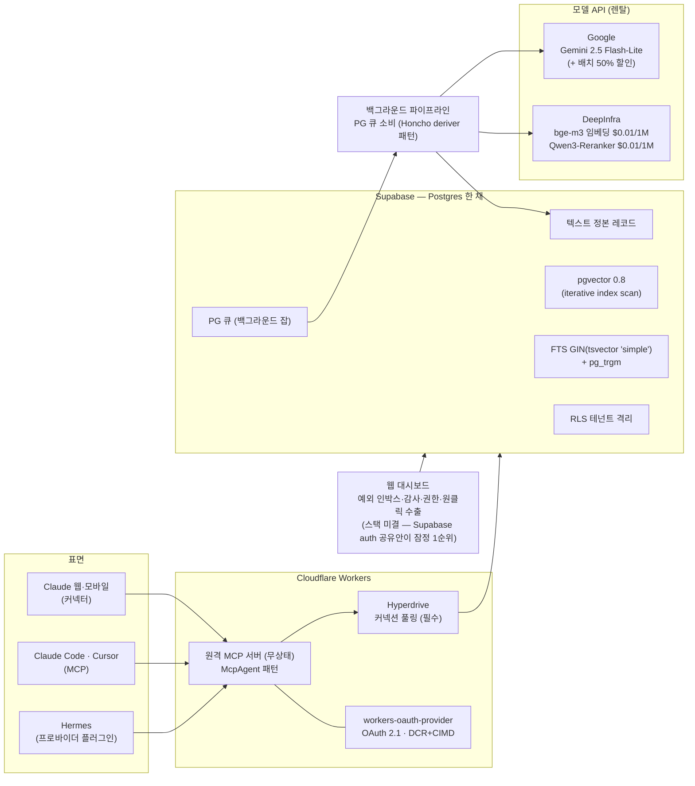
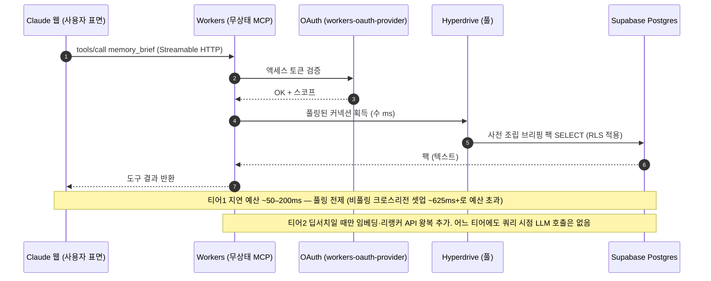

# MCO 인프라 구축 v0.1 (2026-07-12)

> **무엇을 읽는 문서인가.** [아키텍처 설명](MCO_아키텍처설명_v0_1.md)이 '무엇이 어떻게 연결되는가'라면, 이 문서는 '무엇 위에 올리는가' — 인프라 구성, 그 근거, 원가, 보안, 확장 경로, 리스크 운영을 다룬다. **비용은 인프라 원가만 다룬다 — pricing(가격 정책) 논의가 아니며, pricing은 상품성 결론 뒤로 유보된 상태다.** 근거 정본: [`MCO_아키텍처_v0_1.md`](MCO_아키텍처_v0_1.md) §3·§7·§9, `docs/리서치/MCO_한국어검색스택_v0_1.md`, `docs/리서치/MCO_검증리포트_v0_1.md`(P1·P3·P5·P6).

---

## 1. 구성 요약

무상태 MCP 서버는 **Cloudflare Workers**에, 데이터는 **Supabase(Postgres 한 채)**에, 지능은 **외부 모델 API 렌탈**(DeepInfra·Google)로 올린다. 직접 빌드하는 것은 코어 로직뿐 — 인증도, 검색 엔진도, 모델도 빌드하지 않는다. 전제 두 가지가 전체 구성을 관통한다: **무상태 설계**(2026-07-28 MCP 개정 대응)와 **커넥션 풀링 필수**(지연 예산 성립 조건).

## 2. 인프라 구성도

| 컴포넌트 | 역할 | 핵심 선택 |
|---|---|---|
| Cloudflare Workers + McpAgent | 무상태 원격 MCP 서빙 | 상태는 전부 백엔드(DB)에 — Durable Objects에 두지 않음 |
| workers-oauth-provider | OAuth 2.1 (DCR+CIMD, PKCE S256) | 인증은 빌드하지 않는다 — 무료로 시작, 필요 시 WorkOS/Auth0(MCP 전용 지원 GA)로 이행 |
| Hyperdrive | Workers→Postgres 커넥션 풀링 | **필수** — 비풀링 크로스리전 커넥션 셋업 ~625ms+로 지연 예산 초과, 풀링 시 수~수십 ms |
| Supabase | Postgres 한 채: 정본+파생 인덱스+큐+RLS | 관리형 1순위(auth 번들·대시보드와 공유 가능성), 대안 Neon. 검색 5채널이 전부 Postgres 안이라 이식 자유 |
| DeepInfra | bge-m3 임베딩 · Qwen3-Reranker 서빙 | 관리형 실재 + $0.01/1M — 임베딩 대안: Cloudflare Workers AI($0.012/1M) |
| Google (Gemini API) | 추출 LLM(2.5 Flash-Lite 핀) + 배치 | 배치 API 50% 할인(웜스타트·수면 사이클), 임베딩 배치 캡 500k tok 주의 |
| 웹 대시보드 | 예외 인박스·감사·권한·수출 | **스택 미결(§9)** — Supabase auth 공유 시 저비용이라는 잠정 방향만 |

## 3. 요청 시퀀스 — MCP 도구 호출 1건의 왕복

지연 예산의 근거는 업계 수렴이다: Zep P95<200ms, AgentCore ~200ms, Supermemory 500ms 예산 — 그래서 쿼리 시점 LLM 금지가 원칙이 된다. 쓰기(추출·통합)는 백그라운드 초~수십 초가 현업 정상 범위. 플랫폼 제약(도구 응답 300s 타임아웃, 150k자 결과 캡)은 여유 있게 통과한다.

## 4. 왜 이 구성인가 — 현업 수렴 근거

**Workers + McpAgent가 원격 MCP의 최다 프로덕션 검증 경로다.** Asana·Atlassian·Linear·Stripe 등이 이 경로로 출하했다 ([Cloudflare MCP Demo Day](https://blog.cloudflare.com/mcp-demo-day/)). 무상태 설계는 [2026-07-28 MCP 개정](https://blog.modelcontextprotocol.io/posts/2026-07-28-release-candidate/)(세션 핸드셰이크 제거라는 파괴적 변경)을 그대로 흡수한다. OAuth는 DCR+CIMD 동시 지원 — Anthropic이 [고트래픽 커넥터에 CIMD를 권장](https://claude.com/docs/connectors/building/authentication)한다.

**Postgres 한 채는 개인 메모리 서비스 현업의 수렴이다.** Supermemory(PG+pgvector), Honcho(큐까지 PG), Letta Cloud(Aurora PG), Hindsight(PG) — 그래프DB-우선이던 Zep조차 [스케일을 위해 벡터·BM25를 그래프 밖으로 분리](https://blog.getzep.com/scaling-agent-memory-zep-30x/)했다. 유저당 수백~수만 건 규모는 pgvector 2~6ms 영역이고, 0.8.x iterative index scan이 스코프 필터드 벡터 검색을 해결한다.

**검색 5채널이 전부 Postgres 안 — 확장 의존 0.** 한국어 랭킹 FTS는 앱사이드 [Kiwi](https://pypi.org/project/kiwipiepy/) 형태소 정규화 → 섀도 컬럼 → `to_tsvector('simple')`+GIN으로 구현한다(한국어 IR 실측에서 [형태소 토크나이저 ≫ 공백 분리](https://medium.com/@autorag/making-benchmark-of-different-tokenizer-in-bm25-134f2f0e72f8), Kiwi가 유일한 활성 유지 분석기). DB 확장에 의존하지 않으므로 Supabase/Neon/RDS 어디로든 이식되고 WAL/PITR 안전. ParadeDB는 관리형 경로 부재로 기각(P1), PGroonga는 Supabase 한정 보조 백스톱만(TF-only 스코어링·인덱스 WAL 미기록 캐비앳 — [Supabase 문서](https://supabase.com/docs/guides/database/extensions/pgroonga)). 참고: mem0의 BM25는 [영어 하드코딩으로 CJK 무음 무력화](https://github.com/mem0ai/mem0/issues/4884) — **한국어 하이브리드 검색 자체가 경쟁 공백**이다.

**모델은 빌드가 아니라 렌탈.** [DeepInfra bge-m3 $0.01/1M](https://deepinfra.com/BAAI/bge-m3/api)(Gemini 대비 1/15)과 Qwen3-Reranker $0.01/1M(한국어 [18,945쿼리 실측 1위](https://github.com/instructkr/reranker-simple-benchmark)), 추출은 Gemini 2.5 Flash-Lite 핀([유사 서비스가 파인튜닝 베이스로 프로덕션 운용](https://plasticlabs.ai/blog/research/Benchmarking-Honcho)). 선택 기준은 전 항목 **2중 게이트**(관리형 호환성 + 한국어 실측 — 상세는 [아키텍처 설명](MCO_아키텍처설명_v0_1.md) §8, 미검증 항목은 §9의 벤치 게이트로).

**큐도 Postgres.** 별도 큐 인프라(SQS·Redis) 없이 PG 큐로 백그라운드 파이프라인을 돌린다(Honcho deriver 패턴) — 2~4인 팀의 운영 부담 최소화.

## 5. 비용 모델 — 인프라 원가 (pricing 아님)

| 항목 | 원가 | 계산 근거 |
|---|---|---|
| 헤비 유저 (일 5세션 × 10k tok) | **월 $0.75–1.5** | 5역할 파이프라인 ≈ 세션당 $0.005–0.01 |
| 티어1 회상 (브리핑 팩) | 무료급 | DB 읽기만 — LLM·모델 API 호출 없음 |
| 딥서치 리랭킹 (일 20회) | 월 몇 센트 | Qwen3-Reranker $0.01/1M |
| 웜스타트 (3년치 ~5M tok 발굴+임베딩) | **1회성 $1–2** | 배치 API 시 절반. bge-m3 적용 시 임베딩분 ~$0.05 — 사실상 추출 비용만 남음 |
| 캐주얼 유저 | 월 몇 센트 | — |

결론: **무료 티어가 인프라적으로 성립한다**(웜스타트 깊이 캡 전제). 이 표는 "이 구성으로 서비스가 경제적으로 돌아가는가"에 대한 답이지 가격표가 아니다 — pricing은 상품성 결론(정밀도 실험 통과) 뒤에만 논한다. 참고로 시장의 과금 미터 사실 기록: mem0 = 월 add/retrieval 건수, Supermemory = 중복 제거 토큰, GB 저장 미터는 기각됨(매출∝저장량이면 노이즈 축적을 최적화하게 되어 품질 논거와 자충 — 사업성 분석 §6).

## 6. 보안

- **스코프 = 정책 강제.** 계정·법인·프로젝트·에이전트 벽은 태그 필터가 아니라 권한으로 강제하며, DB 레벨에서 RLS 테넌트 격리가 받친다(문서화된 완화책 포함: initPlan 래핑·정책 컬럼 인덱스). 교차 스코프 접근은 항상 사람 승인 게이트.
- **주입 전 스캔.** 기억이 모델에 주입되기 전 프롬프트 인젝션·크리덴셜 패턴을 스캔한다(Hermes에서 차용한 관행).
- **감사 로그.** 모든 기억에 provenance(출처 세션·날짜·단언 주체)가 붙고, 앱별 접근 로그를 대시보드에 노출 — "왜 이걸 알아?"에 항상 답할 수 있다.
- **원클릭 전량 수출.** 사용자 소유의 물리적 보증이자 대시보드의 감정적 앵커("내 지적 재산" 보험).
- **암호화.** 전송(TLS)·저장 시 암호화는 관리형 스택(Workers·Supabase) 기본을 적용한다. 단, 기억은 최고 민감 데이터이므로 상세 프라이버시·보안 모델(암호화 수준·삭제권 보증·보존 정책)은 차터 §9 백로그의 **미결 항목** — 구현 전 확정 필요(§9).

## 7. 확장·이주 경로

**외부 검색 엔진 — 임계값 3개 충족 전 금지.** ⓐ 행 수 ~50만+ ⓑ 사용자 대면 검색 UX(자동완성·패싯)가 기능이 될 때 ⓒ 리랭커 후에도 한국어 리콜 실패가 계측될 때. 그 전까지 Postgres 5채널로 충분하다는 것이 실측 결론(외부 엔진은 유휴 최저 $175~350/mo + 이중 저장소 동기화 운영 리스크).

**전용 벡터 DB(Turbopuffer 등) = 시작점이 아니라 이주 경로.** Cursor·Notion 전례를 따르는 스케일-업 경로이며, 텍스트 정본 규칙 덕에 이주는 파생 인덱스 재생성 = 무손실 배치 작업이다. 임베딩 모델 교체(예: Gemini Embedding 2는 001과 공간 비호환)도 같은 원리로 전량 재임베딩 배치로 처리(배치 캡 500k tok 고려).

**자체 모델 파인튜닝 — 라벨 축적 후의 경로.** 운영에서 쌓이는 라벨(undo·제외·수정·충돌 판정)이 평가셋이 되면 Fireworks LoRA(훈련 $0.50/1M tok, 파인튜닝 모델 서빙 추가비 0)로 5역할 증류를 검토한다([증류로 5–30× 비용 절감 실증](https://www.tensorzero.com/blog/distillation-programmatic-data-curation-smarter-llms-5-30x-cheaper-inference/)). 자산의 본체는 가중치가 아니라 스키마 + 정밀도 평가셋 + 사용자 라벨.

## 8. 리스크 운영

| 리스크 | 대응 | 시점 |
|---|---|---|
| 2026-07-28 MCP 개정 (세션 핸드셰이크 제거) | 무상태 설계로 흡수. 출시 전 RC 검증. 2025-11-25 스펙의 실험적 Tasks API 사용 금지 | 출시 전 |
| claude.ai 연결 무음 실패 악명 | **전 레이어 로깅 1일차부터** + 연결 직후 도구 발화 self-test | 1일차 |
| 웹 표면 호출 의존 (모델이 도구 호출을 결정 — 최대 UX 리스크) | 3중 완화: ⓐ "작업 시작 전 memory_brief" 지침 스니펫 원클릭 설치(온보딩 기본값) ⓑ 대시보드에 앱별 **호출률 텔레메트리**(침묵 열화를 가시 열화로 — ChatGPT 2025-10 커넥터 회귀 전례의 조기 경보) ⓒ 첫 5분은 우리가 제어하는 호출로 구성 | 1일차~상시 |
| 한글 trigram 로케일 의존 (pg_trgm 채널) | 배포 DB에서 `show_trgm('공원')` 결과가 비어 있지 않은지 **1일차 검증 절차** — 실패 사례 실존 | 1일차 |
| Claude 무료 커넥터 1슬롯 정책 · 디렉토리 심사 | 디렉토리 등재 = 출시 요건(심사 실측 2주~수개월을 일정에 예산). 무료 슬롯 정책 변화 감시 | 출시 일정 |
| ChatGPT Apps 데이터 최소화 정책 | "뭐든 기억" 제품과의 긴장 기록 — 진출 시 스코프 필터 설계(후순위) | 후순위 |

## 9. 미결·게이트 항목

확정처럼 쓰지 말 것 — 아래는 전부 대기 중이다:

| # | 항목 | 상태 | 판정 수단 |
|---|---|---|---|
| 1 | 한국어 부품 벤치 3건 — ⓐ 리랭커(Qwen3 vs bge-reranker vs Voyage) ⓑ 임베딩(bge-m3 vs Gemini vs voyage-lite vs KURE) ⓒ 추출(Flash-Lite vs GPT-5-nano/mini, 한·영 코드스위칭 + 출력 언어·스키마 assert) | **벤치 게이트 대기** | 공개 하네스 재사용(instructkr·AutoRAGRetrieval·Ko-StrategyQA·KURE) — 구현 전 API 수준 |
| 2 | 게이트·선택 정밀도 실험 | **관문 (유일한 미검증 코어)** | 베이스라인 = full-context와 BM25 둘 다, 킬 기준 +10점, 기권(abstain) 클래스 포함, 한국어 슬라이스 별도 채점, 점수는 토큰/쿼리·p95와 쌍으로 보고 |
| 3 | 웹 표면 호출률 A/B | 실험 대기 | 지침 스니펫 유/무 비교 — 대시보드 recall-rate 지표의 기준선 |
| 4 | 한글 trigram 1일차 검증 | 배포 시 절차 | `show_trgm('공원')` 비어 있지 않음 확인 |
| 5 | 대시보드 스택 확정 | 미결 | Supabase auth 공유 시 저비용 — 잠정 방향만 |
| 6 | 상세 프라이버시·보안 모델 (암호화 수준·삭제권) | 미결 (차터 §9) | 구현 전 확정 |
| 7 | zerank-2 상업 라이선스 협의 | 선택 항목 | 비상업 라이선스 — 필요 시에만 |
| 8 | 차터 v0.3 반영 · 첫 5분 화면 수준 설계 | 후속 세션 | — |

## 10. 관련 문서

| 문서 | 담당 |
|---|---|
| [`Concept/MCO_시스템개요_v0_1.md`](../Concept/MCO_시스템개요_v0_1.md) | 서사 — 정의·페르소나·UX 원칙·사용자 여정 |
| [`Product/MCO_아키텍처설명_v0_1.md`](MCO_아키텍처설명_v0_1.md) | 구조 — 레이어·데이터 흐름·스키마·모델 선택표 |
| [`Product/MCO_아키텍처_v0_1.md`](MCO_아키텍처_v0_1.md) | **결정 정본** — 전체 근거·출처 |
| `docs/리서치/MCO_한국어검색스택_v0_1.md` | 검색 5채널·모델 교정의 심층 근거(P8) |
| `docs/리서치/MCO_검증리포트_v0_1.md` | 패치 P1~P7의 검증 근거 |

---

*작성: 2026-07-12 문서화 세션. 소스 합의 기준일 2026-07-11(P1~P8 반영). 이 문서는 구성 담당 — 비용 수치는 인프라 원가이며 pricing이 아니다.*
